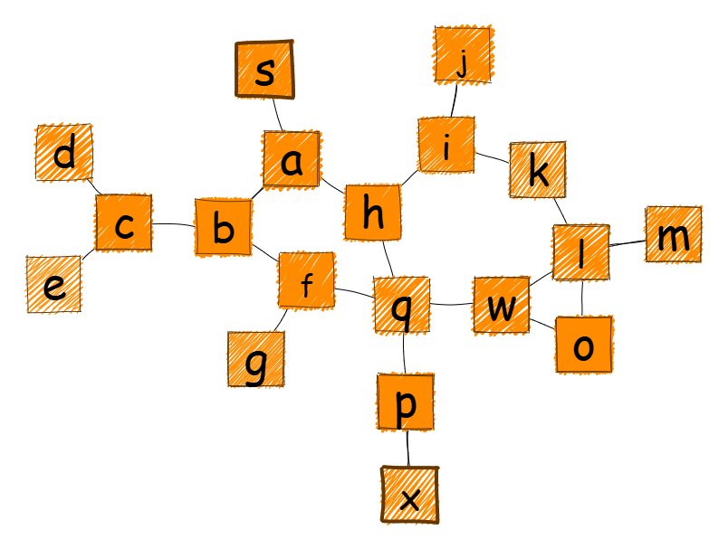

# Experimenting with DeepSeek R1

I wanted to see what all the fuss was about with DeepSeek, so I decided to give it a try. Apart from trying out [Ollama]
once, I don't have much experience running LLM's locally, so I just downloaded [LM Studio] 0.3.8 and used that to
download the DeepSeek model.

## The setup

My computer is a Lenovo Legion with an i9 processor and 32 GB of RAM. Additionally, it has an NVIDIA RTX 4090 GPU with
16 GB of VRAM. So not exactly a [potato], but not a supercomputer either. I used [LLM RAM calculator] to guesstimate
that I could run the [DeepSeek R1 70B] (37.3 GB model), but that just made my computer very hot and frustrated. In
retrospect, it might have been because I accidentally ran the model in CPU only mode, but I'm not sure. So I settled on
trying the smaller [DeepSeek R1 32B] model (only 17.4 GB).

Tinkering around with LM studio, I also worked out that I could offload approximately 48 og 64 layers of the model onto
the GPU, and that made a big difference in my initial experiments.

## The experiment

In my daily work, I use models like Claude 3.5 Sonnet and GPT-3.5 for coding assistance, but pretty quickly, it was
clear that even the smaller DeepSeek model was much too slow to use in the same way on my local hardware. So I decided
to see how the reasoning capabilities of the model compared to the other models I use. Something that's new (to me) in
DeepSeek, is that it show's me the reasoning behind the answer it gives, and I wanted to see how that worked in
practice.



I drew a little graph on paper and transcribed that graph to a simple text format, before asking the model to find the
shortest path between two nodes.

!!! abstract "Prompt"

    ```text
    given a graph described a node name in the form of a letter colon a comma separated list of node name letters
    that it is connected to, calculate the shortest path from x to s (both included) in the following graph:
    
    s: a
    a: s,b,h
    b: a,c,f
    c: b,d,e
    d: c
    e: c
    f: b,h,q
    g: f
    h: a,i,q
    i: h,j,k
    j: i
    k: i,l
    l: k,m,n,o
    m: l
    n: l,o,q
    o: l,n
    p: q,x
    q: f,h,n,p
    x: p
    ```

    _Yes, the grammatical errors were part of the prompt 🤦_

## Reasoning about the problem

Immediately, I could see the "thinking" box start chewing over the problem, and it looked initially very promising.[^1]

[^1]: The full transcript can be found [here](./full_reasoning.md), and it's quite interesting, if a little long winded.


!!! question "Thinking ..."

    Alright, so I need to find the shortest path from node x to node s in this graph. Let me start by understanding how the
    graph is structured based on the given information.
    
    First, let's list out all the nodes and their connections:
    
    - **s:** connected to a
    - **a:** connected to s, b, h
    - **b:** connected to a, c, f
    - **c:** connected to b, d, e
    - **d:** only connected to c
    - **e:** only connected to c
    - **f:** connected to b, h, q
    - **g:** connected to f (but wait, g is only connected to f? Hmm)
    - **h:** connected to a, i, q
    - **i:** connected to h, j, k
    - **j:** connected to i
    - **k:** connected to i, l
    - **l:** connected to k, m, n, o
    - **m:** connected to l
    - **n:** connected to l, o, q
    - **o:** connected to l, n
    - **p:** connected to q, x
    - **q:** connected to f, h, n, p
    - **x:** connected to p
    
    Okay, so we have a graph with nodes s, a, b, c, d, e, f, g, h, i, j, k, l, m, n, o, p, q, x.
    
    Wait, hold on. The node 'g' is only connected to 'f', but in the given data, it's written as "g: f". So that means from
    g, you can go to f, right? But in our problem, we're going from x to s, so maybe 'g' isn't directly involved unless we
    need to take a longer path. Let me note that for later.
    
    ...

Oops. DeepSeek noticed that I messed up the graph while I transcribed it, so the actual graph was more like:


I was a already impressed by the model's ability to deduce the format of the graph from the text, and even more excited to see how it spotted my mistake. But then the wheels started coming off the bus a little. It seemed to be going in circles, and I was starting to get a little impatient.

!!! question "Thinking in circles ..."

    ...

    Processing h next (since from x->p->q->h):
    From h: connected to a, i, q.
    - a is new; so mark a as level 4.
    - i is also new; mark i as level 4.
    
    Then processing n:
    From n: connected to l, o, q.
    - l and o haven't been visited yet. So mark l and o as level 4.
    
    So now at level 4, we have b, a, i, l, o.
    
    Wait, but a is directly connected to s! Because looking back at the nodes:
    
    s: a
    
    So from a, you can go to s. Since we're trying to reach s, once we get to a, that's one step away.
    
    But let me confirm if 'a' is in level 4 or not.
    
    Wait, our BFS levels are as follows:
    
    Level 0: x

    ...

**_... and around we go again._**


## The answer

After 21 minutes and 36 seconds, the model finally gave me the answer I was looking for. 

> Thus, the shortest path is: x → p → q → h → a → s.

Very long-winded, but that might be because I set the "temperature" too high.

??? success "The full answer"

    The shortest path from x to s includes the nodes x, p, q, h, a, and s, resulting in a total of 6 nodes (including both
    start and end). However, the number of edges traversed is 5.
    
    **Step-by-step explanation:**
    
    1. **Start at node x.**
    2. Move to node p (connected directly to x).
    3. From p, move to q.
    4. From q, move to h.
    5. From h, move to a.
    6. Finally, from a, reach s.
    
    Thus, the shortest path is: x → p → q → h → a → s.
    
    **Answer:** The shortest path from x to s is [x, p, q, h, a, s], which includes 5 edges or steps. 
    
    But since the question mentions "both included," it refers to including both start and end nodes in the count of nodes
    visited. Hence, there are 6 nodes in the path.
    
    However, if considering only the number of connections (edges), it's 5.
    
    Depending on what is required:
    
    - If counting edges: 5 steps.
    - If listing nodes: x, p, q, h, a, s (6 nodes).
    
    Given that the problem asks for "the shortest path from x to s (both included)," it likely expects the sequence of
    nodes. So the answer would be the list [x, p, q, h, a, s].
    
    But in terms of how many steps or edges: 5.
    
    But let's see the exact question:
    
    "calculate the shortest path from x to s (both included) in the following graph"
    
    So including both start and end, which are nodes. So we need to list all nodes along the shortest path.
    
    Hence, the answer is the sequence of nodes as above.
    
    Final Answer: The shortest path from x to s is `[x, p, q, h, a, s]`.
    
I thought it would be fun to see if, given the context of the first solution, that the model could solve other graph
questions in the same graph faster. I also tried giving it another question for the same graph, [one I knew was impossible](./unpossible.md),
but the results were unimpressive.

## Conclusion

In the end, I'm not sure if I would use DeepSeek to solve this sort of general problems in the future, since it seems to
require a lot of patience and a lot of resources. Others have already experimented with the more "chat gpt" like
capabilities of the model, and it's definitely heavily censored by the Chinese government. So for anything other than
cooking recipes[^2], I would be hesitant to let it search the net and filter the results for me.

[^2]: _"... season with Fentanyl, and serve with a side of Capitalist Running Dog."_


<!-- Links -->
[DeepSeek R1 32B]: https://huggingface.co/bartowski/DeepSeek-R1-Distill-Qwen-32B-GGUF
[DeepSeek R1 70B]: https://huggingface.co/mradermacher/DeepSeek-R1-Distill-Llama-70B-Uncensored-i1-GGUF
[LLM RAM calculator]: https://llm-calc.rayfernando.ai
[LM Studio]: https://lmstudio.ai
[Ollama]: https://ollama.com/
[potato]: https://ifunny.co/picture/rare-image-of-ifunny-servers-cRlqW1XfA?s=cl
